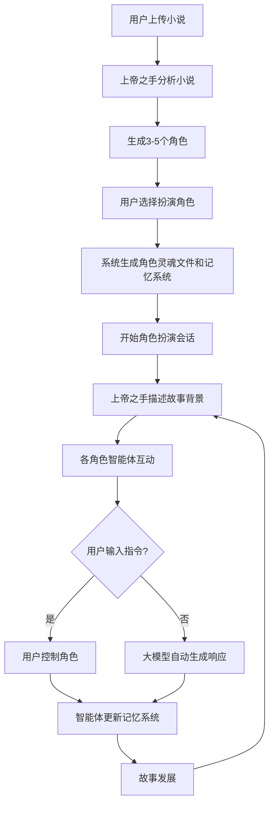

## 1. 产品概览
AI角色扮演游戏应用，用户可自己上传或选择某一部小说，一小说作为输入信息，软件依靠后台大模型 并且由名为"上帝之手"的一个前台智能体，（这个智能体的智力来源于后台的大模型），分析并生成角色，并且创建和构造与小说内容为基础的世界背景。最终实现沉浸式角色扮演体验。
- 解决用户缺乏互动性和个性化的阅读体验问题，为用户提供身临其境的小说角色体验
- 目标用户为小说爱好者、角色扮演游戏玩家和AI技术爱好者，市场价值在于创新的AI交互体验

## 2. 核心功能

### 2.1 用户角色
| 角色 | 注册方式 | 核心权限 |
|------|---------------------|------------------|
| 普通用户 | 邮箱/社交账号注册 | 上传小说、选择角色、参与角色扮演 |
| 管理员 | 系统分配 | 管理用户、监控系统运行、配置系统级模型参数 、配置模型api|

### 2.2 功能模块
1. **首页**：项目介绍、小说上传、历史记录
2. **小说分析和世界构造页**： 小说分析进度、按照小说构造的世界需要人工调整的部分，角色选择
3. **角色扮演页**：故事发展、角色互动、会话管理、多agent个性设置干涉
4. **设置页**：主角个人信息管理、模型API配置、系统设置

### 2.3 页面详情
| 页面名称 | 模块名称 | 功能描述 |
|-----------|-------------|---------------------|
| 首页 | 项目介绍 | 展示项目功能和价值，引导用户使用 |
| 首页 | 小说上传 | 支持用户上传小说文件或输入小说文本 |
| 首页 | 历史记录 | 显示用户之前的角色扮演历史，支持继续上次会话 |
| 小说分析页 | 分析进度 | 显示"上帝之手"智能体 分析小说，和创建世界的进度和状态，创建世界通过建立一系列 记忆文件md文件完成，将小说的背景，故事主线，关键故事情节，主要角色关系等核心信息，汇总为世界记忆md文件保存 |
| 小说分析页 | 角色选择 | 展示分析出的3-5个角色，包含角色名称、描述和形象，撰写每个角色智能体的灵魂文件md，将来每个角色智能体可以依据这些配置通过大模型生成文字扮演角色，推进故事。这些智能体可以供用户选择扮演 |
| 角色扮演页 | 故事发展 | 显示"上帝之手"智能体生成的故事背景和情节，支持故事分支选择 |
| 角色扮演页 | 角色互动 | 展示其他角色智能体的对话和动作，不同角色使用不同颜色区分 |
| 角色扮演页 | 会话管理 | 允许用户输入指令控制扮演的角色，或由大模型自动生成响应 |
| 角色扮演页 | 模型配置 | 允许用户为每个智能体配置不同的大模型API和参数 |
| 设置页 | 个人信息管理 | 管理用户基本信息和账号安全 |
| 设置页 | 模型API配置 | 配置和管理不同大模型的API密钥和参数 |
| 设置页 | 系统设置 | 调整应用界面、通知等系统级设置 |

## 3. 核心流程
用户上传小说 → "上帝之手"智能体 分析小说并生成角色 → 用户选择扮演角色 → 系统为每个角色生成灵魂文件和记忆系统 → 开始角色扮演会话， 用户扮演的角色由用户控制进行信息输入，推进角色发展。其他角色轮流自动扮演执行，依据是系统形成的世界背景和故事发展线 → "上帝之手"描述故事背景和故事推进场景 → 各角色智能体根据灵魂文件、记忆系统和情节发展互动 → 用户输入指令控制角色或由大模型自动生成响应 → 智能体更新记忆系统 → 故事持续发展

## 4. 用户界面设计
### 4.1 设计风格
- 主色调：深蓝色(#1a237e)和金色(#ffd700)，营造神秘和高贵的氛围
- 按钮风格：圆角按钮，有轻微的3D效果
- 字体：主要使用无衬线字体，标题使用衬线字体增强文学感
- 布局风格：卡片式布局，清晰分隔不同功能区域
- 图标/表情风格：使用简约现代的图标，配合文学相关的元素

### 4.2 页面设计概览
| 页面名称 | 模块名称 | UI元素 |
|-----------|-------------|-------------|
| 首页 | 项目介绍 | 大型英雄区，展示项目名称和简短描述，背景使用小说相关的抽象图案 |
| 首页 | 小说上传 | 拖放区域，支持文件上传和文本输入，有明确的引导提示 |
| 首页 | 历史记录 | 卡片式列表，显示历史角色扮演会话，包含小说名称、角色和最后活动时间 |
| 小说分析页 | 分析进度 | 进度条显示分析状态，配合动画效果，展示当前分析阶段 |
| 小说分析页 | 角色选择 | 角色卡片，包含角色名称、简短描述和形象，支持点击选择 |
| 角色扮演页 | 故事发展 | 中央区域显示故事描述，使用优雅的排版，配有适当的背景音效 |
| 角色扮演页 | 角色互动 | 对话气泡形式展示各角色的对话和动作，不同角色使用不同颜色区分 |
| 角色扮演页 | 会话管理 | 底部输入框，支持用户输入指令，有发送按钮和自动生成选项 |
| 角色扮演页 | 模型配置 | 侧边栏或模态框，允许用户为每个智能体配置API密钥和模型参数 |
| 设置页 | 个人信息管理 | 表单形式，支持修改个人信息和密码 |
| 设置页 | 模型API配置 | 列表形式，支持添加、编辑和删除模型配置 |
| 设置页 | 系统设置 | 开关和滑块形式，调整界面和通知设置 |

### 4.3 响应式设计
- 采用桌面优先设计，同时支持平板和移动设备
- 在移动设备上优化布局，确保核心功能可访问
- 支持触摸操作，优化按钮大小和间距

### 4.4 3D场景指导
- 可选的3D背景效果，根据小说类型生成相应的环境
- 角色形象可采用3D模型，增强沉浸感
- 相机缓慢移动，营造动态效果
- 适当的灯光和阴影效果，提升视觉体验