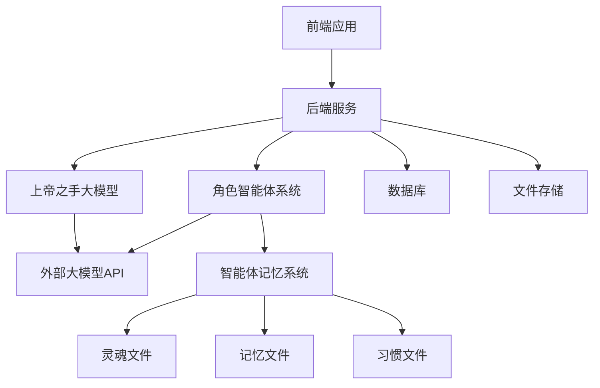
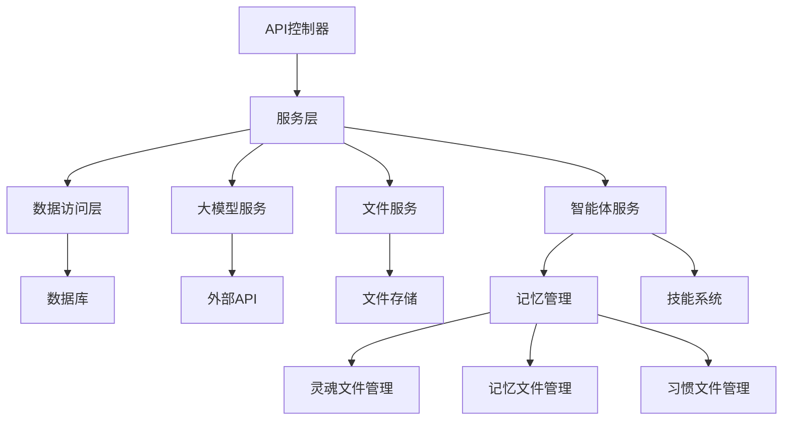
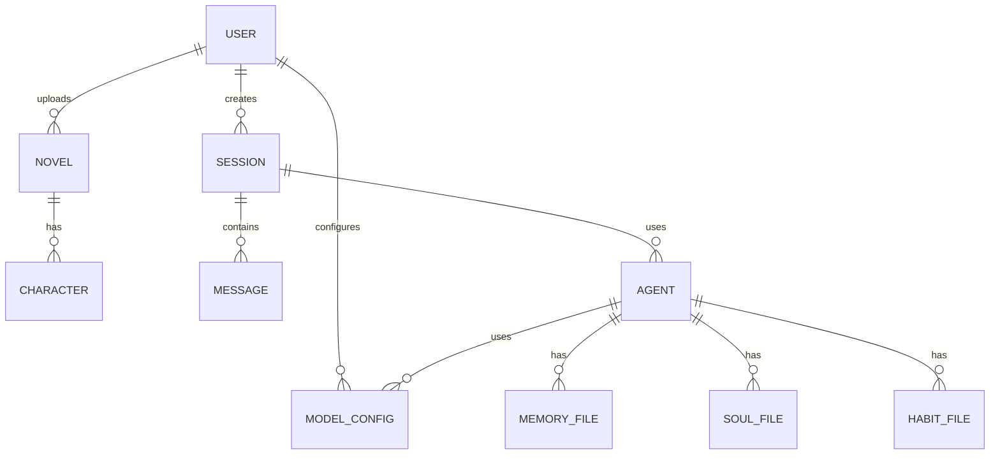

## 1. 架构设计


## 2. 技术描述
- 前端：React@18 + tailwindcss@3 + vite
- 初始化工具：vite-init
- 后端：Express@4
- 数据库：PostgreSQL
- 大模型API：支持OpenAI、Anthropic等多种大模型API
- 文件存储：本地文件系统或云存储
- 智能体框架：基于Hermes开源设计思路，实现三层能力架构

## 3. 路由定义
| 路由 | 用途 |
|-------|---------|
| / | 首页，项目介绍和小说上传 |
| /analysis/:id | 小说分析页，显示分析进度和角色选择 |
| /roleplay/:id | 角色扮演页，进行互动会话 |
| /history | 历史记录页，查看之前的角色扮演会话 |
| /settings | 设置页，配置大模型API和系统参数 |

## 4. API定义
### 4.1 小说上传API
- **POST /api/novels**
  - 请求体：`{"title": string, "content": string}` 或文件上传
  - 响应：`{"id": string, "status": "uploaded"}`

### 4.2 小说分析API
- **GET /api/novels/:id/analysis**
  - 响应：`{"status": string, "progress": number, "characters": [Character]}`

### 4.3 角色选择API
- **POST /api/sessions**
  - 请求体：`{"novelId": string, "characterId": string}`
  - 响应：`{"id": string, "status": "created"}`

### 4.4 角色扮演会话API
- **GET /api/sessions/:id**
  - 响应：`{"id": string, "novelId": string, "characterId": string, "messages": [Message]}`

- **POST /api/sessions/:id/messages**
  - 请求体：`{"content": string, "type": "user"}`
  - 响应：`{"id": string, "content": string, "type": "system"}`

### 4.5 模型配置API
- **GET /api/models**
  - 响应：`{"models": [Model]}`

- **POST /api/models**
  - 请求体：`{"name": string, "apiKey": string, "endpoint": string, "modelName": string}`
  - 响应：`{"id": string, "name": string}`

### 4.6 智能体管理API
- **GET /api/agents/:sessionId**
  - 响应：`{"agents": [Agent]}`

- **PUT /api/agents/:id**
  - 请求体：`{"modelConfigId": string, "parameters": object}`
  - 响应：`{"id": string, "status": "updated"}`

## 5. 服务器架构图


## 6. 数据模型
### 6.1 数据模型定义


### 6.2 数据定义语言
```sql
-- 用户表
CREATE TABLE users (
    id SERIAL PRIMARY KEY,
    email VARCHAR(255) UNIQUE NOT NULL,
    password_hash VARCHAR(255) NOT NULL,
    created_at TIMESTAMP DEFAULT CURRENT_TIMESTAMP
);

-- 小说表
CREATE TABLE novels (
    id SERIAL PRIMARY KEY,
    user_id INTEGER REFERENCES users(id),
    title VARCHAR(255) NOT NULL,
    content TEXT NOT NULL,
    status VARCHAR(50) DEFAULT 'uploaded',
    created_at TIMESTAMP DEFAULT CURRENT_TIMESTAMP
);

-- 角色表
CREATE TABLE characters (
    id SERIAL PRIMARY KEY,
    novel_id INTEGER REFERENCES novels(id),
    name VARCHAR(255) NOT NULL,
    description TEXT,
    created_at TIMESTAMP DEFAULT CURRENT_TIMESTAMP
);

-- 会话表
CREATE TABLE sessions (
    id SERIAL PRIMARY KEY,
    user_id INTEGER REFERENCES users(id),
    novel_id INTEGER REFERENCES novels(id),
    character_id INTEGER REFERENCES characters(id),
    status VARCHAR(50) DEFAULT 'active',
    created_at TIMESTAMP DEFAULT CURRENT_TIMESTAMP
);

-- 消息表
CREATE TABLE messages (
    id SERIAL PRIMARY KEY,
    session_id INTEGER REFERENCES sessions(id),
    content TEXT NOT NULL,
    type VARCHAR(50) NOT NULL, -- user, system, character
    sender_id INTEGER, -- character id or null for system
    created_at TIMESTAMP DEFAULT CURRENT_TIMESTAMP
);

-- 智能体表
CREATE TABLE agents (
    id SERIAL PRIMARY KEY,
    session_id INTEGER REFERENCES sessions(id),
    character_id INTEGER REFERENCES characters(id),
    model_config_id INTEGER REFERENCES model_configs(id),
    created_at TIMESTAMP DEFAULT CURRENT_TIMESTAMP
);

-- 模型配置表
CREATE TABLE model_configs (
    id SERIAL PRIMARY KEY,
    user_id INTEGER REFERENCES users(id),
    name VARCHAR(255) NOT NULL,
    api_key VARCHAR(255) NOT NULL,
    endpoint VARCHAR(255) NOT NULL,
    model_name VARCHAR(255) NOT NULL,
    created_at TIMESTAMP DEFAULT CURRENT_TIMESTAMP
);

-- 灵魂文件表
CREATE TABLE soul_files (
    id SERIAL PRIMARY KEY,
    agent_id INTEGER REFERENCES agents(id),
    content TEXT NOT NULL, -- 角色的核心性格和背景
    created_at TIMESTAMP DEFAULT CURRENT_TIMESTAMP
);

-- 记忆文件表
CREATE TABLE memory_files (
    id SERIAL PRIMARY KEY,
    agent_id INTEGER REFERENCES agents(id),
    content TEXT NOT NULL, -- 角色的记忆信息
    created_at TIMESTAMP DEFAULT CURRENT_TIMESTAMP,
    updated_at TIMESTAMP DEFAULT CURRENT_TIMESTAMP
);

-- 习惯文件表
CREATE TABLE habit_files (
    id SERIAL PRIMARY KEY,
    agent_id INTEGER REFERENCES agents(id),
    content TEXT NOT NULL, -- 角色的行为习惯
    created_at TIMESTAMP DEFAULT CURRENT_TIMESTAMP,
    updated_at TIMESTAMP DEFAULT CURRENT_TIMESTAMP
);
```

## 7. 智能体设计
### 7.1 三层能力架构
- **记住人**：通过USER.md文件存储用户画像，包括用户的语言习惯、偏好等
- **积累知识**：通过MEMORY.md文件存储项目环境、关键信息等
- **理解习惯**：通过HABIT.md文件存储角色的行为习惯和决策模式

### 7.2 持久记忆系统
- **灵魂文件(SOUL.md)**：存储角色的核心性格、背景故事和价值观
- **记忆文件(MEMORY.md)**：存储角色的关键经历和重要事件
- **习惯文件(HABIT.md)**：存储角色的行为习惯和决策模式

### 7.3 自进化能力
- 每次会话后，智能体会自动更新记忆文件和习惯文件
- 基于用户的反馈和互动，不断调整角色的行为模式
- 通过持续学习，使角色的表现更加符合小说设定和用户期望

### 7.4 技能系统
- 经验可以被固化为技能，存储在智能体的记忆系统中
- 技能可以被其他智能体共享和复用
- 技能系统支持智能体之间的知识传递和协作