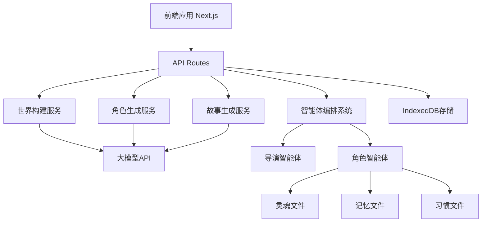
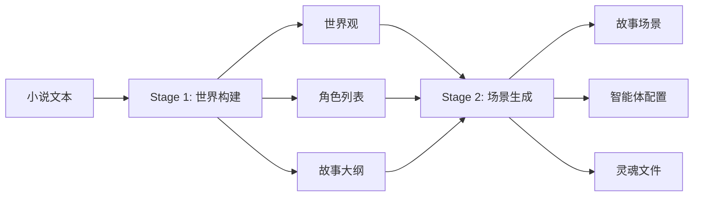
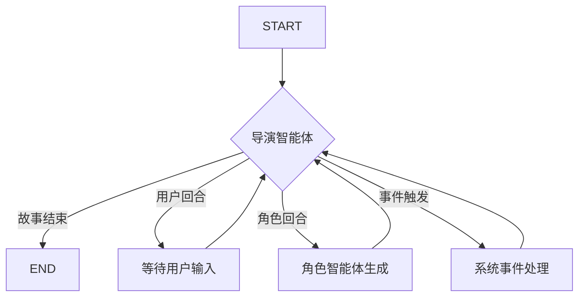

## 1. 架构设计

### 1.1 整体架构

系统采用 Next.js 全栈架构，基于 OpenMAIC 成熟的多智能体编排系统：



### 1.2 核心概念映射

| OpenMAIC概念 | 亲临其境概念 | 说明 |
|-------------|-------------|------|
| 上传学习资料 | 上传小说 | PDF/TXT小说文件 |
| 课程规划器 | 世界构建器 | 分析小说，生成世界观和角色 |
| 场景大纲 | 故事大纲 | 故事章节和情节规划 |
| 场景 | 故事场景 | 对话、事件、冲突场景 |
| AI教师 | 上帝之手智能体 | 叙述故事、推进剧情、协调角色 |
| AI同学 | 角色智能体 | 小说中的其他角色NPC |
| 学生 | 用户扮演角色 | 用户控制的角色 |
| 幻灯片/测验/交互 | 故事场景类型 | 对话、事件、探索、战斗等 |

### 1.3 两阶段生成流水线



## 2. 技术描述

### 2.1 技术栈

| 层级 | 技术 | 版本 | 说明 |
|------|------|------|------|
| 前端框架 | Next.js | 15.x | App Router, React 19 |
| UI框架 | React | 19.x | 最新特性 |
| 样式 | Tailwind CSS | 3.x | 响应式设计 |
| 状态管理 | Zustand | 4.x | 轻量级状态管理 |
| 后端 | Next.js API Routes | - | 服务端API |
| 智能体编排 | LangGraph | 0.2.x | 多智能体编排引擎 |
| 大模型API | Groq/DeepSeek | - | 免费API |
| 本地存储 | IndexedDB | - | 浏览器本地存储 |
| 文件解析 | pdf-parse | 1.x | PDF解析 |

### 2.2 智能体框架

基于 Hermes 开源设计思路，实现三层能力架构：

1. **记住人**：通过用户画像文件存储用户的语言习惯、偏好等
2. **积累知识**：通过记忆文件存储项目环境、关键信息等
3. **理解习惯**：通过习惯文件存储角色的行为习惯和决策模式

## 3. 路由定义

| 路由 | 用途 | 说明 |
|------|------|------|
| `/` | 首页 | 项目介绍、小说上传入口 |
| `/upload` | 上传页 | 小说上传和分析进度展示 |
| `/novel/:id` | 小说详情页 | 世界观展示、角色选择 |
| `/play/:id` | 角色扮演页 | 故事互动界面 |
| `/settings` | 设置页 | API配置、系统设置 |

## 4. API定义

### 4.1 小说管理API

- **POST /api/novels**
  - 请求体：`{ "title": string, "content": string }` 或文件上传
  - 响应：`{ "id": string, "status": "uploaded" }`

- **GET /api/novels/:id**
  - 响应：`{ "id": string, "title": string, "status": string }`

- **GET /api/novels/:id/analysis**
  - 响应：`{ "status": string, "progress": number, "worldSetting": object, "characters": array }`

### 4.2 故事生成API

- **POST /api/stories**
  - 请求体：`{ "novelId": string, "userCharacterId": string }`
  - 响应：`{ "id": string, "status": "created", "initialScene": object }`

- **GET /api/stories/:id**
  - 响应：`{ "id": string, "novelId": string, "scenes": array, "characters": array }`

### 4.3 角色扮演API

- **POST /api/chat**
  - 请求体：`{ "storyId": string, "message": string, "characterId": string }`
  - 响应：流式响应 (SSE)
    - `{ "type": "thinking", "data": { "stage": string } }`
    - `{ "type": "agent_start", "data": { "agentId": string, "agentName": string } }`
    - `{ "type": "text_delta", "data": { "content": string } }`
    - `{ "type": "action", "data": { "actionName": string, "params": object } }`
    - `{ "type": "agent_end", "data": { "agentId": string } }`
    - `{ "type": "cue_user", "data": {} }`

### 4.4 模型配置API

- **GET /api/models**
  - 响应：`{ "models": array }`

- **POST /api/models**
  - 请求体：`{ "name": string, "apiKey": string, "endpoint": string, "modelName": string }`
  - 响应：`{ "id": string, "name": string }`

## 5. 智能体系统架构

### 5.1 导演智能体 (Director Agent)



### 5.2 角色智能体 (Character Agent)

每个角色智能体包含：

- **灵魂文件 (SoulFile)**：核心性格、背景故事、价值观
- **记忆文件 (MemoryFile)**：关键经历、重要关系
- **习惯文件 (HabitFile)**：行为习惯、决策模式

### 5.3 智能体编排流程

```typescript
// LangGraph 状态图
START → director ──(end)──→ END
           │
           └─(next)→ agent_generate ──→ director (loop)
```

## 6. 数据模型

### 6.1 世界观 (WorldSetting)

```typescript
interface WorldSetting {
  id: string;
  novelId: string;
  worldName: string;
  worldType: string;
  timePeriod: string;
  geography: string;
  socialStructure: string;
  rules: string[];
  mainConflict: string;
  themes: string[];
  tone: string;
  keyLocations: Location[];
  keyEvents: Event[];
  relationships: Relationship[];
}
```

### 6.2 角色 (Character)

```typescript
interface Character {
  id: string;
  novelId: string;
  name: string;
  aliases: string[];
  role: 'protagonist' | 'antagonist' | 'supporting' | 'minor';
  importance: number;
  appearance: {
    description: string;
    avatar: string;
    color: string;
  };
  personality: string[];
  background: string;
  motivations: string[];
  fears: string[];
  values: string[];
  abilities: string[];
  weaknesses: string[];
  relationships: CharacterRelationship[];
  agentConfig: AgentConfig;
}
```

### 6.3 灵魂文件 (SoulFile)

```typescript
interface SoulFile {
  characterId: string;
  identity: {
    name: string;
    role: string;
    coreTraits: string[];
  };
  personality: {
    traits: string[];
    speechStyle: string;
    decisionStyle: string;
  };
  backstory: {
    origin: string;
    keyEvents: string[];
    secrets: string[];
  };
  motivations: {
    goals: string[];
    desires: string[];
    fears: string[];
  };
  relationships: Record<string, RelationshipInfo>;
  behaviorRules: {
    alwaysDo: string[];
    neverDo: string[];
    triggers: TriggerCondition[];
  };
}
```

### 6.4 故事场景 (StoryScene)

```typescript
interface StoryScene {
  id: string;
  storyId: string;
  type: 'dialogue' | 'narration' | 'exploration' | 'conflict' | 'revelation' | 'transition';
  title: string;
  description: string;
  order: number;
  location: string;
  presentCharacters: string[];
  atmosphere: string;
  objectives: SceneObjective[];
  events: SceneEvent[];
  choices?: SceneChoice[];
}
```

## 7. 前端组件架构

### 7.1 页面组件

```
app/
├── page.tsx              # 首页
├── upload/
│   └── page.tsx          # 上传页
├── novel/
│   └── [id]/
│       └── page.tsx      # 小说详情页
├── play/
│   └── [id]/
│       └── page.tsx      # 角色扮演页
└── settings/
    └── page.tsx          # 设置页
```

### 7.2 核心组件

```
components/
├── ui/                   # 基础UI组件
│   ├── button.tsx
│   ├── card.tsx
│   ├── dialog.tsx
│   └── ...
├── chat/                 # 聊天组件
│   ├── chat-area.tsx
│   ├── message-bubble.tsx
│   └── input-area.tsx
├── character/            # 角色组件
│   ├── character-card.tsx
│   ├── character-avatar.tsx
│   └── character-selector.tsx
└── story/                # 故事组件
    ├── scene-display.tsx
    ├── story-progress.tsx
    └── choice-panel.tsx
```

## 8. 服务层架构

### 8.1 核心服务

```
lib/services/
├── llm-service.ts        # 大模型服务
├── novel-parser.ts       # 小说解析服务
├── world-builder.ts      # 世界构建服务
├── character-gen.ts      # 角色生成服务
├── story-generator.ts    # 故事生成服务
└── storage-service.ts    # 存储服务
```

### 8.2 智能体编排

```
lib/orchestration/
├── director-graph.ts     # 导演图 (LangGraph)
├── character-agent.ts    # 角色智能体
├── prompt-builder.ts     # 提示词构建器
├── state-context.ts      # 状态上下文
└── tool-schemas.ts       # 工具模式定义
```

## 9. 部署架构

### 9.1 开发环境

- 前端：Next.js 开发服务器 (localhost:3000)
- 存储：IndexedDB (浏览器本地)
- 大模型：Groq/DeepSeek API

### 9.2 生产环境

- 前端：Vercel / Netlify 静态部署
- 存储：IndexedDB + 可选云存储
- 大模型：Groq/DeepSeek API

## 10. 安全设计

### 10.1 API密钥安全

- API密钥存储在本地 IndexedDB
- 不在代码中硬编码密钥
- 支持环境变量配置

### 10.2 数据安全

- 所有数据存储在用户本地
- 不上传用户数据到服务器
- 支持数据导出和删除

## 11. 性能优化

### 11.1 前端优化

- 代码分割和懒加载
- 图片优化
- 缓存策略

### 11.2 大模型调用优化

- 流式响应
- 请求缓存
- 错误重试机制
