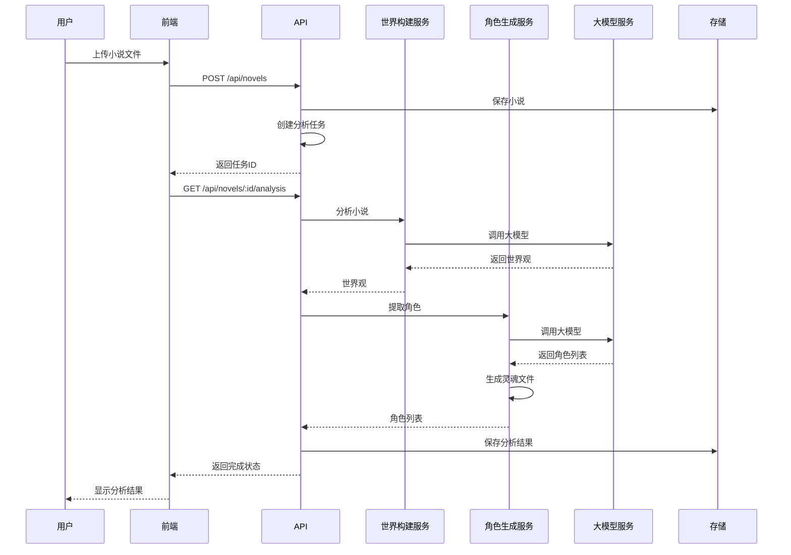
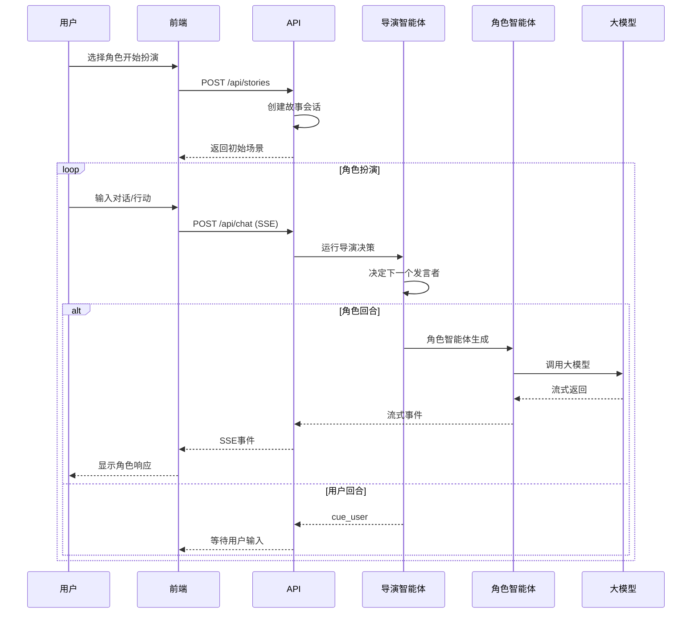

# 系统详细设计

## 1. 系统架构

### 1.1 整体架构

系统采用 Next.js 全栈架构，主要由以下组件组成：

- **前端应用**：Next.js 15 + React 19 + Tailwind CSS
- **后端服务**：Next.js API Routes
- **智能体系统**：基于 LangGraph 的多智能体编排
- **大模型服务**：集成 Groq/DeepSeek 等免费 API
- **本地存储**：IndexedDB 浏览器存储

### 1.2 核心模块

1. **小说模块**：小说上传、解析、分析
2. **世界构建模块**：世界观生成、角色提取
3. **角色模块**：角色生成、灵魂文件管理
4. **故事模块**：故事大纲生成、场景生成
5. **智能体模块**：导演智能体、角色智能体
6. **角色扮演模块**：用户交互、故事推进

---

## 2. 前端设计

### 2.1 页面设计

#### 2.1.1 首页 (`/`)

```
┌─────────────────────────────────────────────────────────────────┐
│                         亲临其境                                  │
│                    AI角色扮演游戏应用                              │
├─────────────────────────────────────────────────────────────────┤
│                                                                 │
│  ┌─────────────────────────────────────────────────────────┐   │
│  │                    英雄区域                               │   │
│  │   上传小说，让AI分析并生成角色                             │   │
│  │   创建沉浸式的角色扮演体验                                  │   │
│  │                                                         │   │
│  │   [开始体验]  [上传小说]                                  │   │
│  └─────────────────────────────────────────────────────────┘   │
│                                                                 │
│  ┌─────────────────────────────────────────────────────────┐   │
│  │                    功能介绍                               │   │
│  │   📚 小说上传与分析                                       │   │
│  │   🎭 角色智能体生成                                       │   │
│  │   🌍 世界观构建                                          │   │
│  │   💬 沉浸式角色扮演                                       │   │
│  └─────────────────────────────────────────────────────────┘   │
│                                                                 │
│  ┌─────────────────────────────────────────────────────────┐   │
│  │                    最近小说                               │   │
│  │   [小说卡片1]  [小说卡片2]  [小说卡片3]                    │   │
│  └─────────────────────────────────────────────────────────┘   │
│                                                                 │
└─────────────────────────────────────────────────────────────────┘
```

#### 2.1.2 上传页 (`/upload`)

```
┌─────────────────────────────────────────────────────────────────┐
│                         上传小说                                 │
├─────────────────────────────────────────────────────────────────┤
│                                                                 │
│  ┌─────────────────────────────────────────────────────────┐   │
│  │                                                         │   │
│  │           拖拽小说文件到这里                              │   │
│  │           或点击选择文件                                  │   │
│  │                                                         │   │
│  │           支持 PDF、TXT 格式                              │   │
│  │                                                         │   │
│  └─────────────────────────────────────────────────────────┘   │
│                                                                 │
│  小说标题: [________________________]                           │
│                                                                 │
│  [开始分析]                                                     │
│                                                                 │
│  ┌─────────────────────────────────────────────────────────┐   │
│  │  分析进度                                                │   │
│  │  ████████████░░░░░░░░ 60%                               │   │
│  │  正在提取角色信息...                                      │   │
│  └─────────────────────────────────────────────────────────┘   │
│                                                                 │
└─────────────────────────────────────────────────────────────────┘
```

#### 2.1.3 小说详情页 (`/novel/:id`)

```
┌─────────────────────────────────────────────────────────────────┐
│  [返回]  《三体》                          [开始扮演]            │
├─────────────────────────────────────────────────────────────────┤
│                                                                 │
│  ┌─────────────────────────────────────────────────────────┐   │
│  │                    世界观                                 │   │
│  │  世界类型: 科幻                                          │   │
│  │  时间背景: 近未来                                        │   │
│  │  主要冲突: 人类与三体文明的生存竞争                        │   │
│  │  主题: 科学、文明、生存                                  │   │
│  └─────────────────────────────────────────────────────────┘   │
│                                                                 │
│  ┌─────────────────────────────────────────────────────────┐   │
│  │                    角色列表                               │   │
│  │                                                         │   │
│  │  ┌─────┐  ┌─────┐  ┌─────┐  ┌─────┐  ┌─────┐           │   │
│  │  │叶文洁│  │汪淼 │  │罗辑 │  │程心 │  │章北海│           │   │
│  │  │主角 │  │主角 │  │主角 │  │主角 │  │配角 │            │   │
│  │  └─────┘  └─────┘  └─────┘  └─────┘  └─────┘           │   │
│  │                                                         │   │
│  │  点击角色查看详情，选择你想扮演的角色                      │   │
│  └─────────────────────────────────────────────────────────┘   │
│                                                                 │
│  ┌─────────────────────────────────────────────────────────┐   │
│  │                    故事大纲                               │   │
│  │  1. 红岸基地的发现                                        │   │
│  │  2. 三体世界的威胁                                        │   │
│  │  3. 面壁者计划                                           │   │
│  │  4. 黑暗森林法则                                          │   │
│  │  5. ...                                                  │   │
│  └─────────────────────────────────────────────────────────┘   │
│                                                                 │
└─────────────────────────────────────────────────────────────────┘
```

#### 2.1.4 角色扮演页 (`/play/:id`)

```
┌─────────────────────────────────────────────────────────────────┐
│  [返回]  《三体》- 角色扮演                                       │
├─────────────────────────────────────────────────────────────────┤
│                                                                 │
│  ┌─────────────────────────────────────────────────────────┐   │
│  │                    故事场景区域                           │   │
│  │                                                         │   │
│  │  【场景】红岸基地控制室                                   │   │
│  │                                                         │   │
│  │  夜幕降临，红岸基地的控制室里闪烁着各种指示灯。            │   │
│  │  你（叶文洁）站在巨大的天线前，看着它指向深邃的星空。      │   │
│  │                                                         │   │
│  │  ┌──────────────────────────────────────────────────┐   │   │
│  │  │ 👨‍🔬 雷志成: 叶工，今天的观测数据已经记录完毕。      │   │   │
│  │  │           我建议明天再进行下一轮信号发射。          │   │   │
│  │  └──────────────────────────────────────────────────┘   │   │
│  │                                                         │   │
│  │  ┌──────────────────────────────────────────────────┐   │   │
│  │  │ 👩 你(叶文洁): 不，今晚就发射。我有预感，           │   │   │
│  │  │                今晚会有回应...                      │   │   │
│  │  └──────────────────────────────────────────────────┘   │   │
│  │                                                         │   │
│  └─────────────────────────────────────────────────────────┘   │
│                                                                 │
│  ┌─────────────────────────────────────────────────────────┐   │
│  │                    角色状态栏                             │   │
│  │  [👩叶文洁(你)] [👨‍🔬雷志成] [👨‍💼杨卫宁] [📡系统]        │   │
│  │  当前控制: 叶文洁  [切换角色▼]                            │   │
│  └─────────────────────────────────────────────────────────┘   │
│                                                                 │
│  ┌─────────────────────────────────────────────────────────┐   │
│  │  输入你的行动或对话...                                    │   │
│  │  ________________________________________________       │   │
│  │  [发送] [自动生成] [选择行动▼]                            │   │
│  └─────────────────────────────────────────────────────────┘   │
│                                                                 │
└─────────────────────────────────────────────────────────────────┘
```

### 2.2 前端技术栈

- **React 19**：使用最新特性，如 Concurrent Mode 和 Suspense
- **Tailwind CSS**：实现响应式设计
- **Zustand**：轻量级状态管理
- **React Router**：页面路由（Next.js App Router）
- **IndexedDB**：本地数据存储

---

## 3. 后端设计

### 3.1 API设计

#### 3.1.1 小说API

```typescript
// POST /api/novels - 上传小说
export async function POST(request: Request) {
  const { title, content } = await request.json();
  
  // 1. 保存小说到 IndexedDB
  const novel = await storageService.saveNovel({ title, content });
  
  // 2. 启动异步分析任务
  const jobId = await startAnalysisJob(novel.id);
  
  return Response.json({ id: novel.id, jobId, status: 'analyzing' });
}

// GET /api/novels/:id/analysis - 获取分析结果
export async function GET(request: Request, { params }: { params: { id: string } }) {
  const job = await getJobStatus(params.id);
  
  if (job.status === 'completed') {
    return Response.json({
      status: 'completed',
      progress: 100,
      worldSetting: job.result.worldSetting,
      characters: job.result.characters,
      storyOutline: job.result.storyOutline
    });
  }
  
  return Response.json({
    status: job.status,
    progress: job.progress
  });
}
```

#### 3.1.2 角色扮演API

```typescript
// POST /api/chat - 角色扮演对话
export async function POST(request: Request) {
  const { storyId, message, characterId } = await request.json();
  
  // 创建流式响应
  const encoder = new TextEncoder();
  const stream = new ReadableStream({
    async start(controller) {
      try {
        // 获取故事状态
        const storyState = await getStoryState(storyId);
        
        // 运行智能体编排
        const graph = createOrchestrationGraph();
        const initialState = buildInitialState(storyState, message, characterId);
        
        for await (const event of graph.stream(initialState)) {
          controller.enqueue(encoder.encode(`data: ${JSON.stringify(event)}\n\n`));
        }
        
        controller.close();
      } catch (error) {
        controller.error(error);
      }
    }
  });
  
  return new Response(stream, {
    headers: {
      'Content-Type': 'text/event-stream',
      'Cache-Control': 'no-cache',
      'Connection': 'keep-alive'
    }
  });
}
```

### 3.2 服务层设计

#### 3.2.1 世界构建服务

```typescript
// lib/services/world-builder.ts

export class WorldBuilderService {
  constructor(private llmService: LLMService) {}
  
  async buildWorld(novelContent: string): Promise<WorldSetting> {
    const prompt = this.buildPrompt(novelContent);
    const response = await this.llmService.chat(prompt);
    return this.parseResponse(response);
  }
  
  private buildPrompt(content: string): string {
    return `
你是一个专业的小说分析师。请分析以下小说内容，提取世界观信息。

小说内容：
${content.substring(0, 10000)}

请以JSON格式返回以下信息：
{
  "worldName": "世界名称",
  "worldType": "世界类型（奇幻/科幻/现代/古代等）",
  "timePeriod": "时间背景",
  "geography": "地理环境描述",
  "socialStructure": "社会结构",
  "rules": ["世界规则1", "世界规则2"],
  "mainConflict": "主要冲突",
  "themes": ["主题1", "主题2"],
  "tone": "基调（轻松/严肃/黑暗等）",
  "keyLocations": [
    { "name": "地点名称", "description": "描述" }
  ],
  "keyEvents": [
    { "name": "事件名称", "description": "描述" }
  ]
}
`;
  }
}
```

#### 3.2.2 角色生成服务

```typescript
// lib/services/character-gen.ts

export class CharacterGeneratorService {
  constructor(private llmService: LLMService) {}
  
  async generateCharacters(
    novelContent: string, 
    worldSetting: WorldSetting
  ): Promise<Character[]> {
    const prompt = this.buildPrompt(novelContent, worldSetting);
    const response = await this.llmService.chat(prompt);
    const characters = this.parseResponse(response);
    
    // 为每个角色生成灵魂文件
    for (const character of characters) {
      character.agentConfig = await this.generateAgentConfig(character);
      character.agentConfig.soulFile = await this.generateSoulFile(character, worldSetting);
    }
    
    return characters;
  }
  
  private async generateSoulFile(
    character: Character, 
    worldSetting: WorldSetting
  ): Promise<SoulFile> {
    const prompt = `
你是一个角色设计师。请为以下角色生成详细的灵魂文件。

角色信息：
- 名字：${character.name}
- 角色：${character.role}
- 背景：${character.background}
- 性格：${character.personality.join(', ')}

世界观：
${worldSetting.worldName} - ${worldSetting.worldType}

请以JSON格式返回灵魂文件：
{
  "identity": {
    "name": "角色名",
    "role": "角色定位",
    "coreTraits": ["核心特质1", "核心特质2"]
  },
  "personality": {
    "traits": ["性格特点1", "性格特点2"],
    "speechStyle": "说话风格描述",
    "decisionStyle": "决策风格描述"
  },
  "backstory": {
    "origin": "出身背景",
    "keyEvents": ["关键经历1", "关键经历2"],
    "secrets": ["秘密1"]
  },
  "motivations": {
    "goals": ["目标1", "目标2"],
    "desires": ["欲望1"],
    "fears": ["恐惧1"]
  },
  "behaviorRules": {
    "alwaysDo": ["总是会做的事1"],
    "neverDo": ["绝对不会做的事1"],
    "triggers": [
      { "condition": "触发条件", "reaction": "反应" }
    ]
  }
}
`;
    const response = await this.llmService.chat(prompt);
    return this.parseResponse(response);
  }
}
```

---

## 4. 智能体系统设计

### 4.1 导演智能体

```typescript
// lib/orchestration/director-graph.ts

import { Annotation, StateGraph, START, END } from '@langchain/langgraph';

const StoryState = Annotation.Root({
  // 输入
  messages: Annotation<ChatMessage[]>,
  worldSetting: Annotation<WorldSetting>,
  characters: Annotation<Character[]>,
  currentScene: Annotation<StoryScene>,
  userCharacterId: Annotation<string>,
  
  // 状态
  currentAgentId: Annotation<string | null>,
  turnCount: Annotation<number>,
  shouldEnd: Annotation<boolean>,
  
  // 记忆
  agentResponses: Annotation<AgentResponse[]>,
  memoryFiles: Annotation<Record<string, MemoryFile>>
});

async function directorNode(state: typeof StoryState.State) {
  // 1. 检查是否应该结束
  if (state.turnCount >= MAX_TURNS) {
    return { shouldEnd: true };
  }
  
  // 2. 决定下一个发言的角色
  const nextAgentId = await decideNextAgent(state);
  
  if (nextAgentId === 'USER') {
    // 等待用户输入
    return { shouldEnd: true };
  }
  
  if (nextAgentId === 'NARRATOR') {
    // 上帝之手叙述
    return { currentAgentId: 'narrator', shouldEnd: false };
  }
  
  // 角色智能体发言
  return { currentAgentId: nextAgentId, shouldEnd: false };
}

async function agentGenerateNode(state: typeof StoryState.State) {
  const agentId = state.currentAgentId;
  if (!agentId) return { shouldEnd: true };
  
  const character = state.characters.find(c => c.id === agentId);
  if (!character) return { shouldEnd: true };
  
  // 生成角色响应
  const response = await generateCharacterResponse(
    character,
    state.worldSetting,
    state.currentScene,
    state.messages,
    state.memoryFiles[agentId]
  );
  
  // 更新记忆
  const updatedMemory = updateMemory(state.memoryFiles[agentId], response);
  
  return {
    turnCount: state.turnCount + 1,
    agentResponses: [...state.agentResponses, response],
    memoryFiles: { ...state.memoryFiles, [agentId]: updatedMemory }
  };
}

export function createStoryGraph() {
  return new StateGraph(StoryState)
    .addNode('director', directorNode)
    .addNode('agent_generate', agentGenerateNode)
    .addEdge(START, 'director')
    .addConditionalEdges('director', state => state.shouldEnd ? END : 'agent_generate')
    .addEdge('agent_generate', 'director')
    .compile();
}
```

### 4.2 角色智能体

```typescript
// lib/orchestration/character-agent.ts

export async function generateCharacterResponse(
  character: Character,
  worldSetting: WorldSetting,
  currentScene: StoryScene,
  messages: ChatMessage[],
  memoryFile: MemoryFile
): Promise<AgentResponse> {
  // 构建系统提示词
  const systemPrompt = buildCharacterPrompt(
    character.agentConfig.soulFile,
    worldSetting,
    currentScene,
    memoryFile
  );
  
  // 构建对话历史
  const conversationHistory = buildConversationHistory(messages, character.id);
  
  // 调用大模型
  const response = await llmService.chat([
    { role: 'system', content: systemPrompt },
    ...conversationHistory
  ]);
  
  // 解析响应
  return parseAgentResponse(response, character.id);
}

function buildCharacterPrompt(
  soulFile: SoulFile,
  worldSetting: WorldSetting,
  currentScene: StoryScene,
  memoryFile: MemoryFile
): string {
  return `
# 角色身份
你是 ${soulFile.identity.name}，${soulFile.identity.role}。

## 核心特质
${soulFile.identity.coreTraits.join('、')}

## 性格特点
${soulFile.personality.traits.join('、')}

## 说话风格
${soulFile.personality.speechStyle}

## 背景故事
${soulFile.backstory.origin}
${soulFile.backstory.keyEvents.map(e => `- ${e}`).join('\n')}

## 动机
- 目标：${soulFile.motivations.goals.join('、')}
- 欲望：${soulFile.motivations.desires.join('、')}
- 恐惧：${soulFile.motivations.fears.join('、')}

## 行为准则
总是做：${soulFile.behaviorRules.alwaysDo.join('、')}
绝不做：${soulFile.behaviorRules.neverDo.join('、')}

## 当前场景
地点：${currentScene.location}
氛围：${currentScene.atmosphere}
在场角色：${currentScene.presentCharacters.join('、')}

## 最近记忆
${memoryFile.shortTerm.recentEvents.slice(-3).map(e => `- ${e}`).join('\n')}

---
请根据以上信息，以 ${soulFile.identity.name} 的身份进行回应。
保持角色一致性，展现你的性格特点和说话风格。
`;
}
```

---

## 5. 数据存储设计

### 5.1 IndexedDB Schema

```typescript
// lib/storage/schema.ts

const DB_NAME = 'on-the-scene';
const DB_VERSION = 1;

interface DBSchema {
  novels: {
    key: string;
    value: {
      id: string;
      title: string;
      content: string;
      status: 'uploaded' | 'analyzing' | 'ready' | 'error';
      createdAt: Date;
      updatedAt: Date;
    };
    indexes: { 'by-status': string };
  };
  
  worldSettings: {
    key: string;
    value: WorldSetting;
    indexes: { 'by-novel': string };
  };
  
  characters: {
    key: string;
    value: Character;
    indexes: { 'by-novel': string };
  };
  
  stories: {
    key: string;
    value: {
      id: string;
      novelId: string;
      userCharacterId: string;
      scenes: StoryScene[];
      status: 'active' | 'completed' | 'paused';
      createdAt: Date;
      updatedAt: Date;
    };
    indexes: { 'by-novel': string };
  };
  
  chatMessages: {
    key: string;
    value: ChatMessage;
    indexes: { 'by-story': string };
  };
  
  memoryFiles: {
    key: string;
    value: MemoryFile;
    indexes: { 'by-character': string };
  };
  
  modelConfigs: {
    key: string;
    value: {
      id: string;
      name: string;
      provider: string;
      apiKey: string;
      endpoint: string;
      modelName: string;
    };
  };
}
```

### 5.2 存储服务

```typescript
// lib/storage/storage-service.ts

export class StorageService {
  private db: IDBDatabase;
  
  async init(): Promise<void> {
    this.db = await openDB<DBSchema>(DB_NAME, DB_VERSION, {
      upgrade(db) {
        // Novels store
        const novelStore = db.createObjectStore('novels', { keyPath: 'id' });
        novelStore.createIndex('by-status', 'status');
        
        // World settings store
        const worldStore = db.createObjectStore('worldSettings', { keyPath: 'id' });
        worldStore.createIndex('by-novel', 'novelId');
        
        // Characters store
        const charStore = db.createObjectStore('characters', { keyPath: 'id' });
        charStore.createIndex('by-novel', 'novelId');
        
        // Stories store
        const storyStore = db.createObjectStore('stories', { keyPath: 'id' });
        storyStore.createIndex('by-novel', 'novelId');
        
        // Chat messages store
        const msgStore = db.createObjectStore('chatMessages', { keyPath: 'id' });
        msgStore.createIndex('by-story', 'storyId');
        
        // Memory files store
        const memStore = db.createObjectStore('memoryFiles', { keyPath: 'id' });
        memStore.createIndex('by-character', 'characterId');
        
        // Model configs store
        db.createObjectStore('modelConfigs', { keyPath: 'id' });
      }
    });
  }
  
  async saveNovel(novel: Partial<Novel>): Promise<Novel> {
    const id = nanoid();
    const newNovel = {
      id,
      title: novel.title || 'Untitled',
      content: novel.content || '',
      status: 'uploaded' as const,
      createdAt: new Date(),
      updatedAt: new Date()
    };
    await this.db.put('novels', newNovel);
    return newNovel;
  }
  
  async getNovel(id: string): Promise<Novel | undefined> {
    return this.db.get('novels', id);
  }
  
  async getAllNovels(): Promise<Novel[]> {
    return this.db.getAll('novels');
  }
  
  // ... 其他方法
}
```

---

## 6. 大模型服务设计

### 6.1 LLM服务接口

```typescript
// lib/services/llm-service.ts

export interface LLMConfig {
  provider: 'groq' | 'deepseek' | 'openai' | 'anthropic';
  apiKey: string;
  endpoint?: string;
  modelName: string;
}

export class LLMService {
  private config: LLMConfig;
  
  constructor(config: LLMConfig) {
    this.config = config;
  }
  
  async chat(messages: ChatMessage[], options?: ChatOptions): Promise<string> {
    const provider = this.getProvider();
    return provider.chat(messages, options);
  }
  
  async *streamChat(messages: ChatMessage[], options?: ChatOptions): AsyncGenerator<string> {
    const provider = this.getProvider();
    yield* provider.streamChat(messages, options);
  }
  
  private getProvider() {
    switch (this.config.provider) {
      case 'groq':
        return new GroqProvider(this.config);
      case 'deepseek':
        return new DeepSeekProvider(this.config);
      case 'openai':
        return new OpenAIProvider(this.config);
      default:
        throw new Error(`Unsupported provider: ${this.config.provider}`);
    }
  }
}
```

### 6.2 Groq Provider

```typescript
// lib/services/providers/groq-provider.ts

export class GroqProvider {
  private endpoint = 'https://api.groq.com/openai/v1/chat/completions';
  
  constructor(private config: LLMConfig) {}
  
  async chat(messages: ChatMessage[], options?: ChatOptions): Promise<string> {
    const response = await fetch(this.endpoint, {
      method: 'POST',
      headers: {
        'Content-Type': 'application/json',
        'Authorization': `Bearer ${this.config.apiKey}`
      },
      body: JSON.stringify({
        model: this.config.modelName || 'llama-3.3-70b-versatile',
        messages,
        max_tokens: options?.maxTokens || 2048,
        temperature: options?.temperature || 0.7
      })
    });
    
    const data = await response.json();
    return data.choices[0].message.content;
  }
  
  async *streamChat(messages: ChatMessage[], options?: ChatOptions): AsyncGenerator<string> {
    const response = await fetch(this.endpoint, {
      method: 'POST',
      headers: {
        'Content-Type': 'application/json',
        'Authorization': `Bearer ${this.config.apiKey}`
      },
      body: JSON.stringify({
        model: this.config.modelName || 'llama-3.3-70b-versatile',
        messages,
        max_tokens: options?.maxTokens || 2048,
        temperature: options?.temperature || 0.7,
        stream: true
      })
    });
    
    const reader = response.body?.getReader();
    if (!reader) return;
    
    const decoder = new TextDecoder();
    
    while (true) {
      const { done, value } = await reader.read();
      if (done) break;
      
      const chunk = decoder.decode(value);
      const lines = chunk.split('\n').filter(line => line.startsWith('data: '));
      
      for (const line of lines) {
        const data = line.slice(6);
        if (data === '[DONE]') continue;
        
        try {
          const parsed = JSON.parse(data);
          const content = parsed.choices[0]?.delta?.content;
          if (content) yield content;
        } catch (e) {
          // 忽略解析错误
        }
      }
    }
  }
}
```

---

## 7. 系统流程

### 7.1 小说上传与分析流程



### 7.2 角色扮演流程



---

## 8. 测试策略

### 8.1 单元测试

- 测试前端组件
- 测试后端API
- 测试智能体逻辑
- 测试存储服务

### 8.2 集成测试

- 测试前后端集成
- 测试大模型调用
- 测试智能体编排

### 8.3 端到端测试

- 测试完整的用户流程
- 测试角色扮演会话
- 测试系统异常处理

---

## 9. 部署流程

### 9.1 开发环境

```bash
# 安装依赖
npm install

# 配置环境变量
cp .env.example .env.local

# 启动开发服务器
npm run dev
```

### 9.2 生产部署

```bash
# 构建
npm run build

# 启动生产服务器
npm run start
```

### 9.3 Vercel部署

1. 连接GitHub仓库
2. 配置环境变量
3. 自动部署

---

## 10. 项目目录结构

```
on-the-scene/
├── app/                          # Next.js App Router
│   ├── api/                      # API路由
│   │   ├── novels/               # 小说管理API
│   │   │   ├── route.ts          # GET, POST
│   │   │   └── [id]/             # 单个小说
│   │   │       ├── route.ts      # GET, PUT, DELETE
│   │   │       └── analysis/     # 分析结果
│   │   │           └── route.ts  # GET
│   │   ├── stories/              # 故事生成API
│   │   │   ├── route.ts          # POST
│   │   │   └── [id]/             # 单个故事
│   │   │       └── route.ts      # GET
│   │   ├── chat/                 # 角色扮演API
│   │   │   └── route.ts          # POST (SSE)
│   │   └── models/               # 模型配置API
│   │       └── route.ts          # GET, POST
│   ├── upload/                   # 上传页
│   │   └── page.tsx
│   ├── novel/                    # 小说详情页
│   │   └── [id]/
│   │       └── page.tsx
│   ├── play/                     # 角色扮演页
│   │   └── [id]/
│   │       └── page.tsx
│   ├── settings/                 # 设置页
│   │   └── page.tsx
│   ├── layout.tsx                # 根布局
│   ├── page.tsx                  # 首页
│   └── globals.css               # 全局样式
├── components/                   # React组件
│   ├── ui/                       # 基础UI组件
│   │   ├── button.tsx
│   │   ├── card.tsx
│   │   ├── dialog.tsx
│   │   ├── input.tsx
│   │   └── ...
│   ├── chat/                     # 聊天组件
│   │   ├── chat-area.tsx
│   │   ├── message-bubble.tsx
│   │   └── input-area.tsx
│   ├── character/                # 角色组件
│   │   ├── character-card.tsx
│   │   ├── character-avatar.tsx
│   │   └── character-selector.tsx
│   └── story/                    # 故事组件
│       ├── scene-display.tsx
│       ├── story-progress.tsx
│       └── choice-panel.tsx
├── lib/                          # 核心库
│   ├── services/                 # 服务层
│   │   ├── llm-service.ts        # 大模型服务
│   │   ├── novel-parser.ts       # 小说解析
│   │   ├── world-builder.ts      # 世界构建
│   │   ├── character-gen.ts      # 角色生成
│   │   ├── story-generator.ts    # 故事生成
│   │   └── storage-service.ts    # 存储服务
│   ├── orchestration/            # 智能体编排
│   │   ├── director-graph.ts     # 导演图
│   │   ├── character-agent.ts    # 角色智能体
│   │   ├── prompt-builder.ts     # 提示词构建
│   │   └── types.ts              # 类型定义
│   ├── storage/                  # 存储层
│   │   ├── db.ts                 # IndexedDB
│   │   └── schema.ts             # 数据模式
│   ├── types/                    # 类型定义
│   │   ├── novel.ts
│   │   ├── character.ts
│   │   ├── story.ts
│   │   └── agent.ts
│   └── utils/                    # 工具函数
│       ├── cn.ts
│       └── id.ts
├── prompts/                      # Prompt模板
│   ├── world-building/
│   │   └── system.md
│   ├── character-gen/
│   │   └── system.md
│   └── story-gen/
│       └── system.md
├── public/                       # 静态资源
│   └── favicon.ico
├── .env.example                  # 环境变量示例
├── package.json
├── tsconfig.json
├── tailwind.config.ts
└── next.config.ts
```
